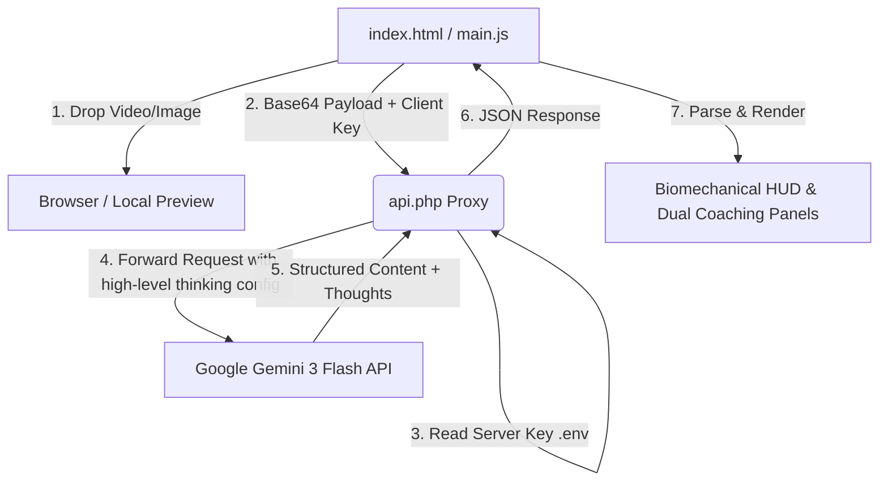

# 🏏 ShotIQ | AI Cricket Shot Biomechanical Analyzer

[]()
[]()
[]()
[]()

**ShotIQ** is a premium, high-performance web application designed for cricketers, coaches, and sports analysts. It delivers instant, frame-by-frame biomechanical reasoning and telemetry directly from raw batting clips and images using **Google Gemini 3 Flash** (featuring high-level cognitive "thinking" capabilities).

Constructed entirely with a **100% build-less, framework-free vanilla stack** (pure HTML5, CSS3, and ES6+ JavaScript), it integrates a secure server-side PHP proxy to protect developer API keys, offering professional-grade analysis in a lightweight and ultra-portable package.

---

## ⚡ Key Capabilities

*   **🧠 Deep Biomechanical Telemetry:** Displays the raw reasoning chain, kinematics breakdown, and structural thoughts of the AI during analysis in a collapsible console-style HUD.
*   **🏏 Dual Coaching Feedback:** Provides independent, action-oriented evaluations and ratings (`Good`, `Average`, `Poor`) for both the **Batter** (footwork, weight transfer, shot execution) and the **Bowler** (line, length, tactical delivery difficulty) alongside custom coaching tips.
*   **📊 Multi-Layered Metric Telemetry:** Extracts precise metrics in milliseconds:
    *   *Categorization:* Mechanical coaching term (e.g., Cover Drive, Pull Shot) and popular/fan name (e.g., Helicopter Shot).
    *   *Ball-Tracking:* Estimated pitch length, delivery line, and ball deviation.
    *   *Kinematics:* Trigger movement, head stability, contact quality (sweet spot vs. edge), and launch angle.
    *   *Outcomes:* Overall control rating and field boundary/wicket results.
*   **🔒 Dual-Mode API Security:**
    *   *Server Mode:* Loads the API key securely from a server-side `.env` file, protecting developer billing limits.
    *   *Browser Fallback:* Allows users to input their own Gemini API key inside a secure settings drawer, stored locally in the browser's `localStorage`.
*   **💾 Technical Report Utility:** Compile the complete AI reasoning chain and the parsed JSON analytical report into a clean, downloadable text document with one click.
*   **🎨 Premium Cyber-Athletic Aesthetics:** Designed with an immersive, dark HUD-style layout, glowing neon voltage accents, fluid floating backgrounds, and glassmorphic micro-animations.

---

## 🏗️ Architecture & Flow

ShotIQ uses a server-side proxy pattern to communicate with Google's API securely without complicated Node.js builds, Webpack configs, or heavy dependencies:



---

## 📂 File Breakdown

*   [index.html](file:///var/www/codepane.com/html/shotiq-repo/index.html): The interactive web single-page interface featuring an animated drag-and-drop scanner ring, visual progress HUD, and comprehensive dashboard layouts.
*   [style.css](file:///var/www/codepane.com/html/shotiq-repo/style.css): Premium styling sheet defining the cyber-athletic dark mode, glassmorphic HUD elements, and responsive layout spacing.
*   [main.js](file:///var/www/codepane.com/html/shotiq-repo/main.js): Coordinates frontend events, manages the dual-mode API key states, handles drag-and-drop files, base64 encodes media, sends the proxy payloads, and parses response structures.
*   [prompts.js](file:///var/www/codepane.com/html/shotiq-repo/prompts.js): Houses the carefully engineered `CRICKET_ANALYSIS_PROMPT` containing precise biomechanical analysis constraints and rigid JSON formatting parameters.
*   [api.php](file:///var/www/codepane.com/html/shotiq-repo/api.php): A secure, lightweight server-side PHP script which fallbacks from server key configuration to header-passed client credentials, wrapping cURL connections to the Google Generative Language API.

---

## 🛠️ Setup & Local Running

ShotIQ requires **no build toolchain** (no `npm install`, no `vite`, no compiling). It runs instantly on any standard PHP-enabled web server (e.g. Apache, Nginx, or Caddy with PHP 7.4+).

### 1. Place the files on your Web Server
Clone the repository or move all files to your local web root directory (e.g., `/var/www/html/` or `/var/www/codepane.com/html/shotiq-repo/`).

### 2. Configure Environment Variables
Copy `.env.temp` to a new file named `.env`:
```bash
cp .env.temp .env
```
Open the `.env` file and insert your Google Gemini API Key:
```env
GEMINI_API_KEY=your_actual_gemini_api_key_here
```
*(Note: If you leave the server API key blank, the application will fallback to requesting a browser key from the user via the frontend configuration drawer).*

### 3. Open in Browser
Point your web browser to the hosting path:
```
http://localhost/shotiq-repo/index.html
```

---

## ⚡ Direct Telemetry Prompt Schema
At the core of the application lies `prompts.js`, which strictly instructs Gemini 3 Flash to return structured JSON mapping the following schema:

```json
{
  "shot_type_mechanical": "Formal coaching name or Unknown",
  "shot_type_colloquial": "Popular/fan name or Unknown",
  "direction": "Field region (e.g., Mid-wicket, Long-on) or Unknown",
  "characteristics": "Brief description of footwork, bat path, and follow-through",
  "overall_confidence": 95,
  "delivery_data": {
    "length": "Yorker/Full/Good/Short/Unknown",
    "line": "Off/Middle/Leg/Unknown",
    "deviation": "Swing/Spin/Straight/Unknown",
    "confidence": 90
  },
  "biomechanics_impact": {
    "trigger_movement": "Footwork description or Unknown",
    "head_alignment": "Stable/Falling off/Unknown",
    "contact_quality": "Sweet spot/Edge/Miss/Unknown",
    "launch_angle": "Grounded/Lofted/Aerial/Unknown",
    "confidence": 95
  },
  "outcome_stats": {
    "control_status": "In Control/Not In Control/Unknown",
    "visible_result": "Boundary/Wicket/Dot/Runs/Unknown",
    "confidence": 85
  },
  "evaluation_and_feedback": {
    "batter": {
      "quality_rating": "Good/Average/Poor/Unknown",
      "reasoning": "Explanation of shot execution and body biomechanics...",
      "suggestion": "Coaching suggestion..."
    },
    "bowler": {
      "quality_rating": "Good/Average/Poor/Unknown",
      "reasoning": "Explanation of delivery quality and tactical target...",
      "suggestion": "Tactical adjustment recommendation..."
    }
  },
  "observations": [
    "Technical insights not immediately visible to standard viewer..."
  ]
}
```

---

## 📝 License

This project is licensed under the MIT License.
